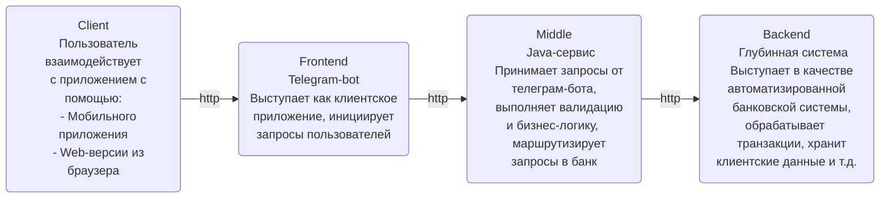

# Telegram bot / GPB-IT-FACTORY
___

Telegram bot - одно из приложений, разрабатываемых в рамках стажировки GPB-IT-FACTORY. Выступает как клиентское приложение, инициирующее запросы пользователей

___
### Содержание
* [Установка](#installation)
* [Возможности](#features)
* [Технологии](#technologies)
* [Лицензия](#license)


### <a id="installation">Установка приложения</a>
___
В ближайшее время здесь будет инструкция по установке приложения, но уже сейчас можно:
1. Проверить версию java (требуется поддержка java 21):
```
java --version
```
Если требуется установка или обновление java, воспользуйтесь [инструкцией](https://www.youtube.com/watch?v=kpluwWxUVNk)

2. Что-то еще
3. Третий шаг


### <a id="features">Возможности приложения</a>
___
Телеграм-бот позволяет эмулировать запросы пользователей и отправлять их в сервис основной бизнес-логики:




### <a id="technologies">Применяемые технологии</a>
___
При разработке приложения используются следующие технологии:
- java 21
- spring boot 3
- telegram bot java library 
- gradle
- ...


### <a id="license">Лицензия</a>
___
GNU GPLv3