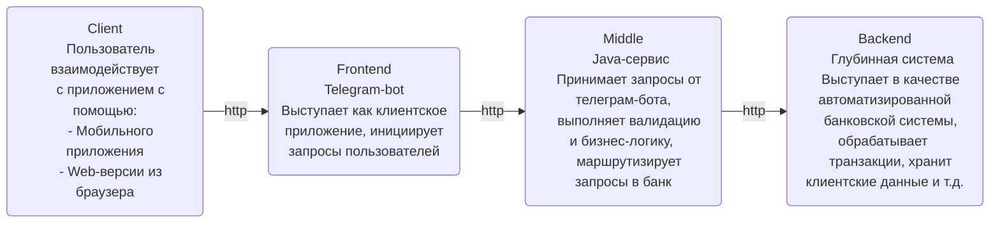

# Telegram bot / GPB-IT-FACTORY
___

Telegram bot - одно из приложений, разрабатываемых в рамках стажировки GPB-IT-FACTORY. Выступает как клиентское приложение, инициирующее запросы пользователей

___
### Содержание
* [Установка](#installation)
* [Возможности](#features)
* [Технологии](#technologies)
* [Лицензия](#license)


### <a id="installation">Установка приложения</a>
___
Для локальной установки приложения вам понадобятся [Git](https://git-scm.com/), [Java 21](https://axiomjdk.ru/pages/downloads/), [Gradle](https://gradle.org/), [Docker](https://www.docker.com/), поэтому:
1. Проверьте, установлен ли Git:
```shell
git --version
```
Если Git не установлен, следуйте [инструкции](https://git-scm.com/book/ru/v2/%D0%92%D0%B2%D0%B5%D0%B4%D0%B5%D0%BD%D0%B8%D0%B5-%D0%A3%D1%81%D1%82%D0%B0%D0%BD%D0%BE%D0%B2%D0%BA%D0%B0-Git) по установке для вашей платформы
2. Проверьте, установлен ли Gradle:
```shell
gradle -v
```
Если Gradle не установлен, следуйте [инструкции](https://gradle.org/install/) по установке для вашей платформы
3. Подготовьте окружение для локального запуска приложения. Для этого в переменные окружения необходимо внести следующие записи:
```shell
export GPB_BOT_NAME="GPB Telegram bot"
export GPB_BOT_TOKEN="Укажите_здесь_полученный_токен"
```
Если не знаете, как получить собственный токен бота, прочтите [инструкцию](https://core.telegram.org/bots/features#botfather)
4. Клонируйте репозиторий и перейдите в каталог с программой:
```shell
git clone https://github.com/gpb-it-factory/bryanin-telegram-bot.git
cd bryanin-telegram-bot
```
5. Запустите команду:
```shell
./gradlew bootRun
```
По этой команде Gradle соберет проект и запустит программу
6. Для проверки работы бота перейдите в приложение Telegram или откройте [web-версию](https://web.telegram.org), затем откройте бота **@gpb_bryanin_telegram_bot**, нажмите команду "Начать", и после приветствия отправьте команду "/ping" - в ответ Вы должны получить "pong"


### <a id="features">Возможности приложения</a>
___
Телеграм-бот позволяет эмулировать запросы пользователей и отправлять их в сервис основной бизнес-логики:




### <a id="technologies">Применяемые технологии</a>
___
При разработке приложения используются следующие технологии:
- java 21
- spring boot 3
- telegram bot java library 
- gradle
- ...


### <a id="license">Лицензия</a>
___
GNU GPLv3